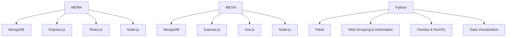

# David Datunashvili👋

Full Stack Web Developer • Python Developer • Lecturer at Ilia State University

---

## Skills

---

## Social Media

[LinkedIn](https://www.linkedin.com/in/ddatunashvili/) • [Instagram](https://instagram.com/ddatunashvilii) • [Facebook](https://www.facebook.com/ddatunashvilii)

## Community

[Discord](https://discord.gg/4nYEVunyWv) • [YouTube](https://www.youtube.com/channel/UCZA10Y495KC6BfHBeW7CXMQ)

---

## GitHub Stats

---

## Projects

* **RENODE** – PHP + Next.js + Go
* **DISCORDGE** – Vue + Express.js
* **MOVIX.GE** – React + Express.js
* **Proxy Server** – Flask

---

## Work & Teaching

* **CEO & Founder – RE:NODE** (2021–Now)
* **Web Developer – STARMAN AGENCY** (2021–2023)
* **Invited Lecturer – Ilia State University** (2022–Now)

---

## Contact

**Email:** [davitidatunashvili98@gmail.com](mailto:davitidatunashvili98@gmail.com)
